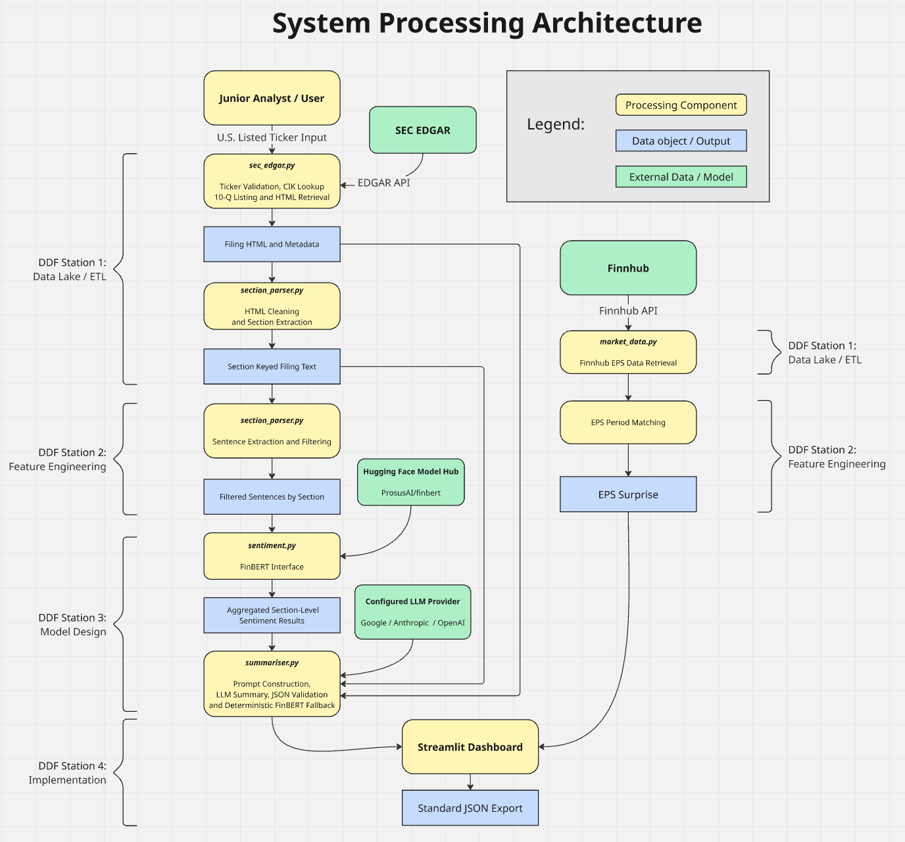
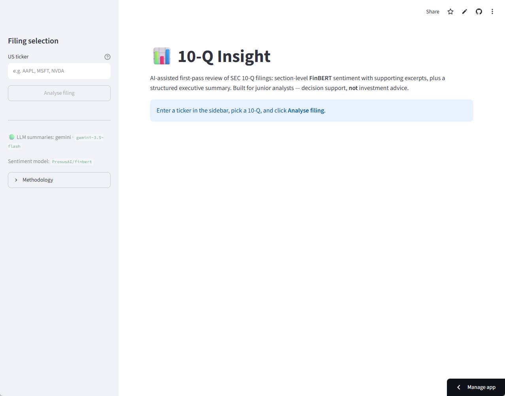
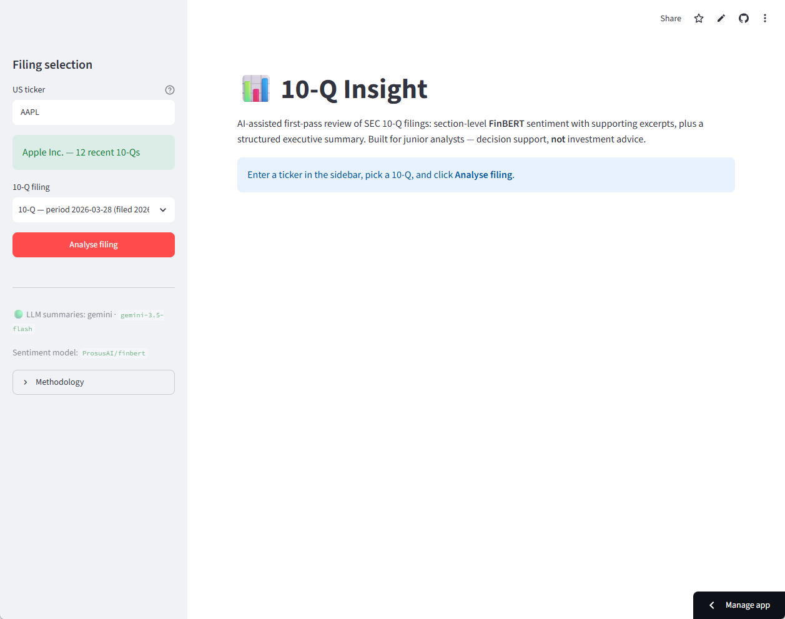
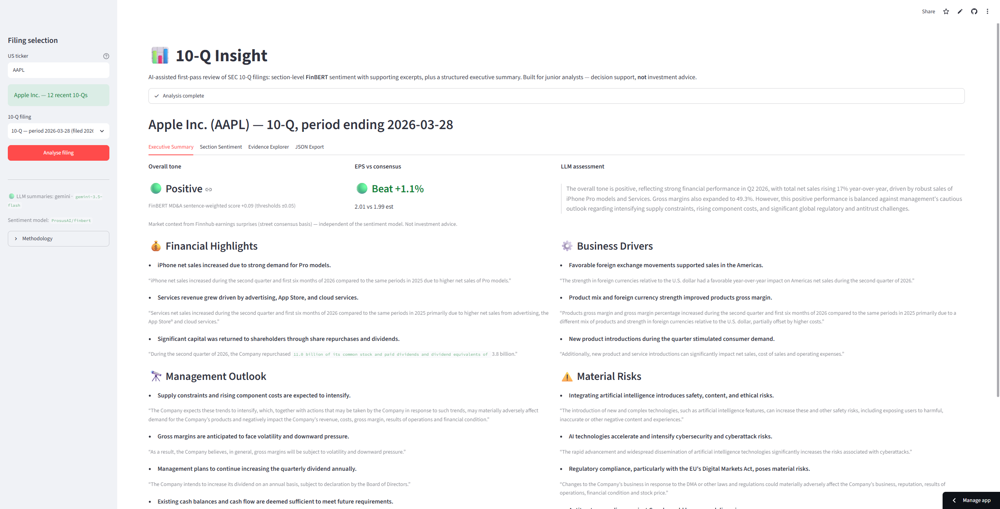
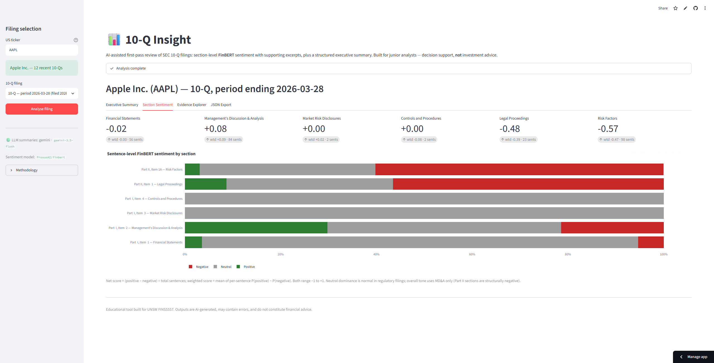
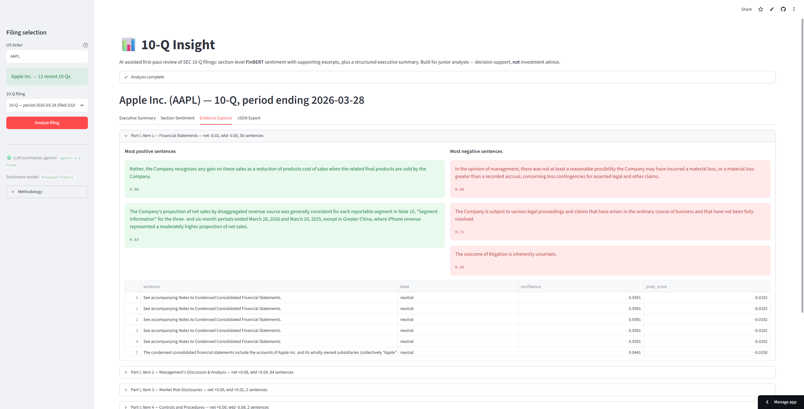

<h1 align="center"> SEC Filing Insight: AI Assisted Financial Filing Review</h1>

<p align="center">
  <em>FINS5557 Applied AI in Finance — Track A Group Project</em>
</p>

<p align="center">
  Section-level FinBERT sentiment analysis, earnings-surprise context,
  and evidence-supported LLM executive summaries.
</p>

<h4 align="center">
  Author: Jiayuan Gao, Yu Gu, Zijun Lu,   
</h4>

## Overview

SEC Filing Insight is an AI-assisted financial filing analysis application.
The current version retrieves and analyses SEC 10-Q filings using FinBERT,
Finnhub earnings-surprise data, and large language models.

Support for additional filing types, including Form 10-K, is planned for
future releases.

> This application is designed for educational and decision-support purposes.
> It does not provide financial or investment advice.

<p align="center">
  
  
  
  
  

## Live Application

[Open the deployed application](https://fins5557sentimentanalysis.streamlit.app/)

> **Live deployment configuration:** The deployed Streamlit application is
> currently configured to use Google Gemini 3.5 Flash (`gemini-3.5-flash`)
> for LLM-assisted executive summaries. FinBERT (`ProsusAI/finbert`) is used
> separately for sentence-level financial sentiment analysis. If the Gemini
> service is unavailable, the application falls back to a deterministic
> FinBERT-based summary.

## Features

- Retrieve recent SEC 10-Q filings using the official SEC EDGAR APIs
- Identify standard 10-Q sections, including:
  - Financial Statements
  - Management’s Discussion and Analysis
  - Market Risk Disclosures
  - Controls and Procedures
  - Legal Proceedings
  - Risk Factors
- Perform sentence-level sentiment analysis using FinBERT
- Calculate section-level net and probability-weighted sentiment scores
- Generate an LLM-assisted executive summary
- Display evidence sentences supporting the analysis
- Retrieve analyst consensus EPS for the filing period using Finnhub API
- Compare reported EPS with analyst consensus
- Export the complete analysis as JSON
- Fall back to a deterministic FinBERT summary if the LLM is unavailable


## System Architecture



## Installation

### System Requirements

- Python 3.10 or later
- Internet access for retrieving SEC filings and external API data
- An SEC-compliant User-Agent
- Finnhub API key for earnings-surprise data
- Gemini, Anthropic, or OpenAI API key for LLM-generated summaries

If no supported LLM API key is provided, the application automatically falls
back to a deterministic FinBERT-based summary.

### Python Dependencies

The project uses the following Python packages:

| Package | Minimum Version | Purpose |
|---|---:|---|
| `requests` | 2.31 | SEC EDGAR and external API requests |
| `python-dotenv` | 1.0 | Loading environment variables from `.env` |
| `beautifulsoup4` | 4.12 | Parsing SEC filing HTML |
| `lxml` | 5.0 | HTML and XML parsing backend |
| `transformers` | 4.44 | Loading and running FinBERT |
| `torch` | 2.2 | FinBERT model runtime |
| `anthropic` | 0.40 | Optional Anthropic LLM integration |
| `openai` | 1.40 | Optional OpenAI LLM integration |
| `google-generativeai` | 0.8 | Optional Gemini LLM integration |
| `streamlit` | 1.36 | Interactive web application |
| `pandas` | 2.0 | Tabular data processing |
| `plotly` | 5.20 | Interactive data visualisation |

The complete dependency specification is available in
[`requirements.txt`](requirements.txt).

### 1. Clone the repository

```bash
git clone https://github.com/harrygaojiayuan/FINS5557_Sentiment_Analysis.git
cd FINS5557_Sentiment_Analysis
```
### 2. Create a virtual environment

Windows:

```powershell
python -m venv .venv
.venv\Scripts\activate
```

macOS or Linux:

```bash
python3 -m venv .venv
source .venv/bin/activate
```

### 3. Install dependencies

```bash
pip install -r requirements.txt
```

### 4. Configure environment variables

Copy the example environment file.

Windows PowerShell:

```powershell
Copy-Item .env.example .env
```

macOS or Linux:

```bash
cp .env.example .env
```

Edit `.env` and add the required values:

```env
SEC_USER_AGENT="10-Q Insight your.email@example.com"

GOOGLE_API_KEY="your-google-api-key"
GEMINI_MODEL="gemini-3.5-flash"

MAX_SENTENCES_PER_SECTION=300

FINNHUB_API_KEY="your-finnhub-api-key"
```

Do not commit the `.env` file or expose real API keys.

## Running the Application

```bash
streamlit run app.py
```

Open the local URL displayed in the terminal, normally:

```text
http://localhost:8501
```

## Usage

1. Enter a US-listed company ticker, such as `AAPL`.
2. Select one of the company’s recent 10-Q filings.
3. Click **Analyse filing**.
4. Wait for the filing retrieval, FinBERT analysis and summary generation.
5. Review the following tabs:
   - Executive Summary
   - Section Sentiment
   - Evidence Explorer
   - JSON Export

### Worked Example
Typical User Interface is as below:

<p align="center">
  
</p>

Enter AAPL, for example, and press enter to apply. Select a recent 10-Q from the dropdown menu and click **Analyse filing**. The application
will display section-level positive, neutral and negative sentiment, together
with an executive summary and supporting source sentences.

<p align="center">
  
</p>

## Screenshots

### Executive Summary

<p align="center">
  
</p>

### Section Sentiment

<p align="center">
  
</p>

### Evidence Explorer

<p align="center">
  
</p>

## Sentiment Methodology
Each extracted sentence is classified by FinBERT as positive, neutral or
negative.

The section net score is calculated as:

```text
Net score = (positive sentences - negative sentences) / total sentences
```

The probability-weighted score is calculated as:

```text
Weighted score = mean(P(positive) - P(negative))
```

The overall filing tone is primarily based on the MD&A section:

```text
Score > 0.05   → Positive
Score < -0.05  → Negative
Otherwise      → Neutral
```

## Dependencies

Major dependencies include:

- `streamlit` — web interface
- `transformers` and `torch` — FinBERT inference
- `beautifulsoup4` and `lxml` — SEC filing parsing
- `requests` — SEC EDGAR and Finnhub requests
- `pandas` and `plotly` — data processing and visualisation
- `python-dotenv` — environment variable management
- `google-generativeai`, `anthropic`, and `openai` — optional LLM providers

See [`requirements.txt`](requirements.txt) for the complete dependency list.

## API Configuration

The application selects an LLM provider in the following priority order:

1. Google Gemini
2. Anthropic Claude
3. OpenAI
4. FinBERT heuristic fallback

Only configure the provider that you intend to use. If no LLM API key is
available, the application remains functional using the deterministic
FinBERT fallback.

## Performance Optimisations

- FinBERT is loaded once using Streamlit resource caching.
- SEC filing responses are cached for one hour.
- Sentences are processed in batches rather than individually.
- The number of sentences analysed per section is capped to maintain
  acceptable performance on CPU-based hosting.

## Known Issues and Limitations

- Only US-listed companies that submit 10-Q filings are supported.
- Non-standard filing layouts may prevent some sections from being detected.
- Tables and highly numerical text are mostly excluded from sentiment analysis.
- FinBERT may classify formal regulatory language as predominantly neutral.
- LLM-generated summaries may contain inaccurate or incomplete statements.
- Sentences without terminal punctuation may be excluded.
- Finnhub earnings data may be unavailable for some companies or periods.

## Planned Enhancements

- Compare sentiment across consecutive quarters
- Detect newly introduced risk factors
- Add automated tests for section parsing and summary validation
- Validate LLM evidence against the original filing text
- Support additional filing types such as 10-K

## Project Team

Developed by:

- Jiayuan Gao, zID: z5435605
- Yu Gu, zID: z5598191
- Zijun Lu, zID: z5370746

## AI Tool Disclosure

### AI-Assisted Development

The project team used **OpenAI Codex, powered by the GPT-5.6 model**, **Anthropic Claude Code, 
powered by Fable 5 model** as AI coding and documentation assistant during development.

Claude Code was used for the following tasks: 
- Project scoping and planning
- Project architecture and design advice
- Coding assistance with ETL, feature engineering, and model design
- Streamlit integration guidance
- Debugging assistance
- Testing and verification

Codex was used for the following tasks:

- Reviewing the project code against the assignment requirements and marking criteria
- Identifying missing requirements, documentation gaps and terminology inconsistencies
- Assisting with debugging and code-quality review
- Drafting and refining selected sections of the README
- Improving Markdown and HTML formatting used in the project documentation

The following code files were edited with help of AI:

| File                  | AI Model                                                                 | AI responsibility                                                                            |
|-----------------------|--------------------------------------------------------------------------|----------------------------------------------------------------------------------------------| 
| config.py             | Anthropic Claude Code Fable 5                                            | Helped with model call priority bug fixing                                                   |
| sec_edgar.py          | Anthropic Claude Code Fable 5                                            | Helped with accessing filing from SEC EDGAR                                                  |
| section_parser.py     | Anthropic Claude Code Fable 5                                            | Helped with parsing HTML filing documents, and sentence extraction                           |
| sentiment.py          | Anthropic Claude Code Fable 5                                            | Helped with deterministic tone, and bug fixing                                               |
| summariser.py         | Anthropic Claude Code Fable 5                                            | Helped with prompt construction, model coordination, rationale, and summary generation       |
| pipeline.py           | Anthropic Claude Code Fable 5                                            | Helped with setting up the pipeline                                                          |
| market_data.py        | Anthropic Claude Code Fable 5                                            | Helped with accession of data from Finnhub through API                                       |
| evaluation.py         | Anthropic Claude Code Fable 5                                            | Helped with evaluation for sentiment models, and bug fix                                     |
| threshold_analysis.py | Anthropic Claude Code Fable 5                                            | Helped with threshold evaluation and bug fix                                                 |
| performance_test.py   | OpenAI Codex GPT 5.6 Sol, and  <br/> Anthropic Claude Code Fable 5       | GPT 5.6 helped with idea generation, and Fable 5 helped with testing application performance |
| app.py                | Anthropic Claude Code Fable 5                                            | Helped with streamlit integration and bug fix                                                |

All AI-generated suggestions and content were reviewed, tested and, where necessary,
modified by the project team. The team retained responsibility for the final
code, system design, analysis, documentation and submitted work. AI-generated
content was not accepted without human verification.

### AI Models Integrated into the Application

The application itself supports the following AI models for users:

| Provider / Organisation | Model              | Role in the Application                                                                                             |
|---|--------------------|---------------------------------------------------------------------------------------------------------------------|
| Prosus AI, distributed through Hugging Face | `ProsusAI/finbert` | Performs sentence-level financial sentiment classification and returns positive, neutral and negative probabilities |
| Google | `Any`              | Generates the structured executive summary from filing text and FinBERT results                                     |
| Anthropic | `Any`              | Alternative provider for generating the structured executive summary                                                |
| OpenAI | `Any`              | Alternative provider for generating the structured executive summary                                                |

Although the LLM models could be configured to any models developed by
Google, Anthropic and OpenAI with a valid API key, for development of the application,
the following models were originally adopted for testing executive summary generation

1. Google: gemini-3.5-flash
2. Anthropic: claude-haiku-4-5-20251001
3. OpenAI: gpt-4o-mini

Only one LLM model is used for each analysis. When multiple API keys are
configured, the application selects a provider in the following order:

1. Google Gemini
2. Anthropic Claude
3. OpenAI
4. Deterministic FinBERT-based fallback

The selected LLM receives extracted SEC filing text, filing metadata and
aggregated FinBERT sentiment results. It is instructed to produce a structured
JSON summary covering:

- Financial highlights
- Business drivers
- Management outlook
- Material risks
- Supporting evidence from the filing
- An overall assessment rationale

The final overall tone is not determined freely by the LLM. It is calculated
from the sentence-weighted FinBERT score for the Management Discussion and
Analysis section. If that section is unavailable, the application falls back
to the available filing sections.

If no LLM API key is configured, or if the selected LLM request fails, the
application generates a deterministic summary using FinBERT results and
rule-based evidence selection. Therefore, the application remains functional
without a generative-AI API.

Model names can be configured through environment variables. The model and
provider actually used for an analysis are recorded in the exported result for
transparency and reproducibility.

## Disclaimer

This application is provided for educational and informational purposes only.
It does not constitute financial, investment, legal, tax or regulatory advice.
Users should verify all outputs against the original SEC filing.